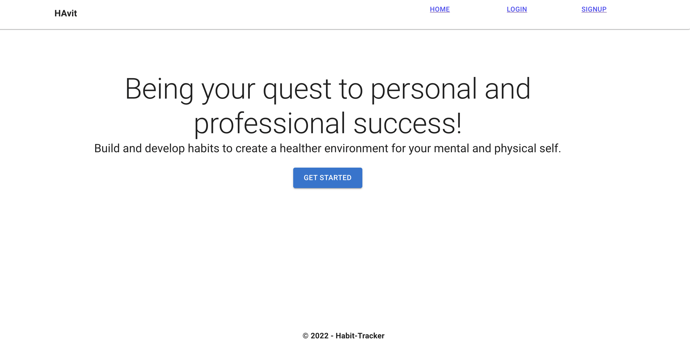
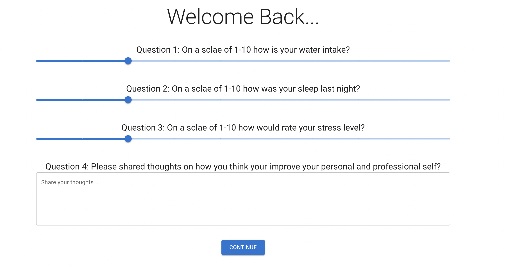
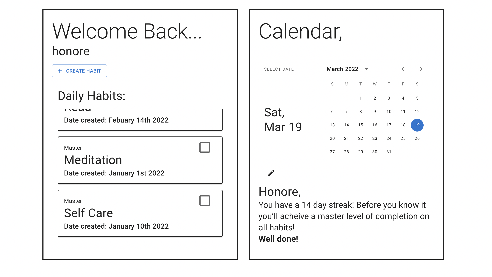
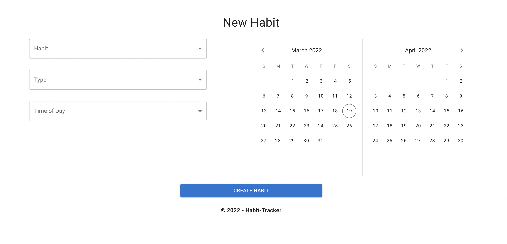
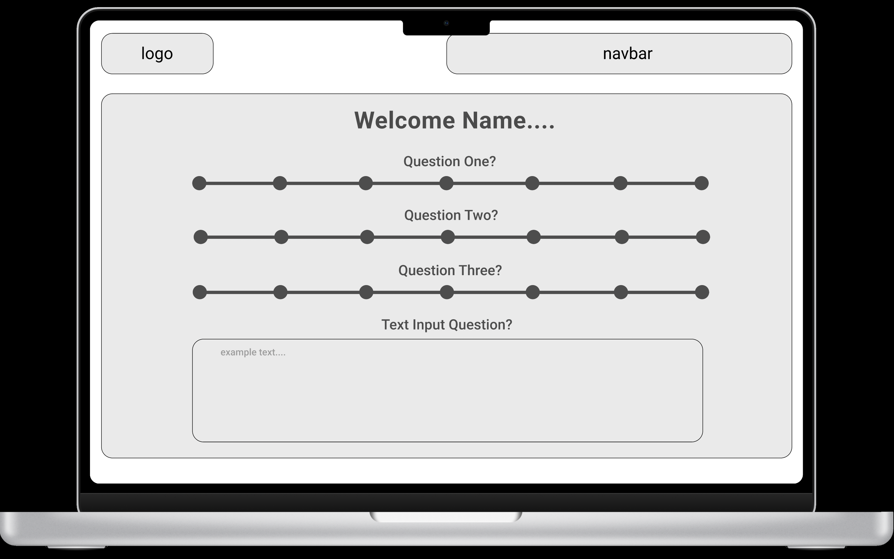
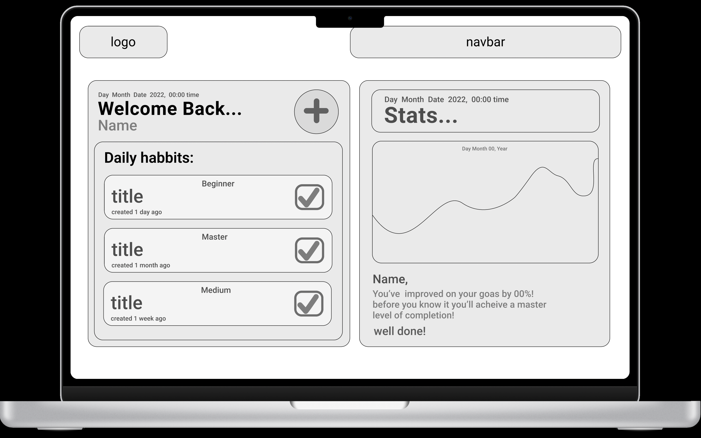
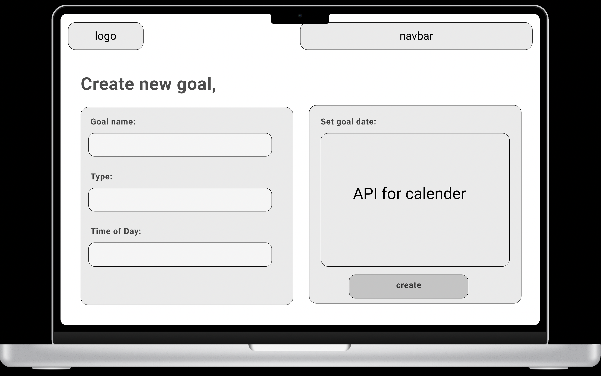

# Havet: The all in one habit tracker

#### **Name:** Honore, Ellie, Lizbet, Sahana
#### **Deployed Link:** https://havit-tracker.herokuapp.com/
#### **Github Repo:** https://github.com/matisses-goldfish/Project3
---
    
##  Table of Contents:
* [Description](#description)
* [Application](#application)
* [Usage Information](#usage)
* [Technologies Used](#technologies-used)
* [Wireframe](#Wireframe)
* [Testing Instructions](#testing)
* [Authors](#authors)
* [License](#license)
* [Question](#questions)

## Description:
---
How do I grow in my career? How can I improve my chances of securing stable income while working on something fun and alongside amazing people?

 

Even though the answer depends on your unique situation, there is a common thread, and it lies in your habits. In the classic book, The Coaching Habit, Michael Stanier says that to “build an effective new habit, you need five essential components: a reason, a trigger, a micro-habit, effective practice, and a plan.” As coders it's extremely important to stay healthy, balanced and happy. 

 

What we need are the 4 components: a trigger, a micro-habit, effective practice, and a plan.

---
### Havit Provides:
* A trigger for you to practice your habit during the time of the day you’ve pre-selected
* A list of micro-habits that will help you achieve a more balanced, energized self
* A heat map to track how consistent your habit practice is
* A calendar to help you plan the target date by which you can bring your habit to a higher level of mastery

## Application:
---
### Home Page

### Progress Page

### Dashboard Page

### New habit Page

## Usage
---
Begin the application by clicking the link provided above (https://havit-tracker.herokuapp.com/), then navigating to the 'get started' button. Once you've created an account, press the 'get started' button again to navigate to the progress page. From there you'll be able to interact with your dashboard, add a new habit, and view the customized heatmap! 

## Technologies Used:
---
* Github
* Material UI 
* GraphQL
* Mongodb
* Javascript
* React
* Npm React- Activity Calendar
* Figma

## Wireframe:
---

### Progress Page

### Dashboard Page

### New Habit Page

## Contribution Guidelines
---
Contribute using the Github work flow model.
    
## Authors
---
**Honore, Ellie, Lizbet, Sahana** - *Initial work* - [Havet](https://github.com/matisses-goldfish/Project3)
    
## License
---

This project is licensed under the  License - see the [LICENSE.md](LICENSE.md) file for details
  

## Question
---
Any additional question? 
### Contact the team members at:
* Github: Honore @matisses-goldfish
* Github: Ellie @boocipher
* Github: Lizbet @rlizbett
* Github: Sahana @sahanamai

